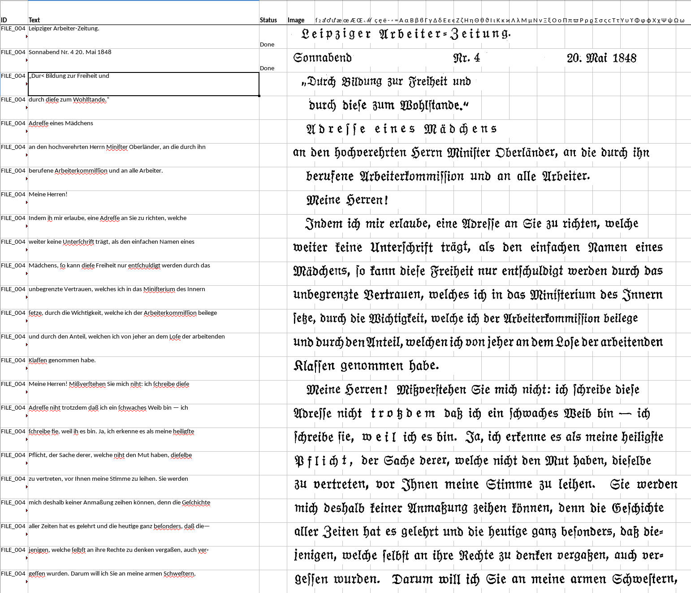
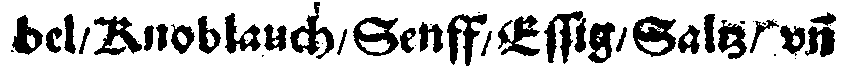

layout: true
  

  <table>
    <tr>
      <td style="text-align:right">Sächsische Landesbibliothek – Staats- und Universitätsbibliothek</td>
      <td>109. Bibliothekartag</td>
      <td style="text-align:right"><a href="https://www.slub-dresden.de/">www.slub-dresden.de</a></td>
    </tr>
    <tr>
      <td style="text-align:right">Referate 4.3 & 2.5</td>
      <td>17. Juni 2021</td>
    </tr>
  </table>

  <table>
    <tr>
      <td style="text-align:left"><b>Kay-Michael Würzner</b></td>
      <td style="text-align:left"><b>Robert Sachunsky</b></td>
    </tr>
    <tr>
      <td style="text-align:left">Referat Open Science</td>
      <td style="text-align:left">Referat Digitale Objekte</td>
    </tr>
    <tr>
      <td style="font-size:8pt"><b>17. Juni 2021</b></td>
    </tr>
    <tr>
      <td style="font-size:8pt">109. Bibliothekartag</td>
    </tr>
  </table>

---

class: title-slide
count: false

# Kollaborative Erstellung von Trainingsmaterialien für OCR
## Ein Werkstattbericht

---

# Überblick

- Prinzipien OCR
- Datenvorbereitung
- Transkription
- Training
- Diskussion

---

class: part-slide

# Vielen Dank für Ihre Beteiligung!

---

# Überblick

0. Werkauswahl
1. OCR-D-Workflow (manuell optimiert je Werk)
2. Extraktion von .xslx-Dateien
   - 1 Datei pro Seite
   - 1 Zeile pro Textzeile
3. Verteilung an je 2 Bearbeiter
4. Import des Rücklaufs
   - Textnormalisierung (automatische Nachkorrektur; optional)
   - Double-Keying zur Qualitätskontrolle
   - Konfliktbereinigung (manuelle Nachkorrektur; optional)
5. Export Zeilen-GT
   - Format für tesstrain/ocropus/kraken/…
   - Publikation auf [Github](https://github.com/slub/slub_ocr_gt)
6. Training und Experimente

---

class: part-slide

# Prinzipien OCR

---

# Wie funktioniert's?

- Schritt 1: Zeilenerkennung
    + **regelbasierte** (Bildmorphologie) oder
    + **datengetriebene** Verfahren (e.g. Pixelklassifikation)

↓

---

# Wie funktioniert's?

- Schritt 2: Vektorisierung
    + **Skalierung** auf einheitliche Höhe
    + **Unterteilung** in 1pixel-breite Streifen

↓

---

# Wie funktioniert's?

- Schritt 3: Textermittlung
    + **Übergangswahrscheinlichkeiten** zwischen Vektoren
    + Rückgriff auf (offline) trainiertes **Modell**

↓

oberwähntem Tage mancher sorgliche Gedanke auf, 
&amp; wir seufzten öfters zum Heiland, daß Er uns 
vor allem Schaden, der uns etwa in der folgen- 
den Nacht begegnen könnte, in Gnaden bewahren

---

# Wie funktioniert's?

- resultierende Textqualität (auch) abhängig von Modellpassung
    * Modell: Wahrscheinlichkeitsverteilung über mgl. Zeichen
- mitgelieferte Modelle häufig ungeeignet für historische Vorlagen
    * unzureichende Passung zwischen Trainings- und Anwendungsdaten
    * synthetisches Training
- Initiativen zur Erhebung von Trainingsdaten für historische Vorlagen
    * `GT4HistOCR` ([Springmann et al. 2018](https://arxiv.org/ftp/arxiv/papers/1809/1809.05501.pdf))
    * Fibeln 19. Jahrhundert ([Weil et al. 2020](https://github.com/UB-Mannheim/Fibeln))
    * NewsEye Austraian Newspapers 19th C. ([Mühlberger und Hackl 2019](https://zenodo.org/record/3387369#.YLY43nVfjCM))
- starker Fokus auf Fraktur 19. Jahrhundert

---

class: part-slide

# Datenvorbereitung

- Werkauswahl
- OCR-Workflow
- Ergebnisse

---

# Werkauswahl

- historische Antiqua
    * bisher wenig beachtet
    * erstaunliche Vielfalt von Schriftarten
    * historische Zeichen und Diakritika
- Fraktur 20. Jahrhundert
    * teilweise große Abweichungen zur „Standardfraktur“
    * Festschriften und Schmuckdrucke
- Sorbisch (vgl. [Würzner und Böhmak 2019](https://zenodo.org/record/3387369#.YLY43nVfjCM))
    * zahlreiche Diakritika
    * **keine** annähernd adäquaten Modelle vorhanden
- Latein

---

# OCR-Workflow

- Konfiguration und Prozessierung mit [OCR-D](https://ocr-d.de)
- meist:
  * Binarisierung: [SBB](https://github.com/qurator-spk/sbb_binarization) (neuronal)
  * Cropping: [Ocropus](https://github.com/OCR-D/ocrd_anybaseocr) (regelbas.)
  * Deskewing: [Ocropus](https://github.com/cisocrgroup/ocrd_cis/) / [Tesseract](https://github.com/OCR-D/ocrd_tesserocr) (regelbas.)
  * Segmentierung: [Ocropus](https://github.com/cisocrgroup/ocrd_cis/) / [Tesseract](https://github.com/OCR-D/ocrd_tesserocr) (regelbas.)
  * Dewarping: [Ocropus](https://github.com/cisocrgroup/ocrd_cis/) (regelbas.)
  * Erkennung: [Tesseract](https://github.com/OCR-D/ocrd_tesserocr) (neuronal)
- Anpassung je nach Material und Sprachen
- Rückgriff auf existierende, bestpassende OCR-Modelle

---

class: part-slide

# Transkription

- Annotationsumgebung
- Transkriptionsrichtlinien
- Textnormalisierung
- Ergebnisse

---

# Annotationsumgebung

- Excel / LibreOffice Calc
  * Offline
  * Rechtschreibkontrolle
  * ...
- 1 Tabelle pro Seite mit 1 Zeile pro Textzeile und Spalten für:
  * ID (aus PAGE-XML)
  * Text (aus OCR)
  * Status (offen/fertig/fehlerhaft)
  * Bild (aus Binarisierung und Zeilensegmentierung)  
    Klick → Faksimile (DFG-Viewer)

---

# Annotationsumgebung – Ansicht

---

# Transkriptionsrichtlinien

- Orientierung an [DTA](https://www.deutschestextarchiv.de/doku/basisformat/transkription.html) / [OCR-D](https://ocr-d.de/de/gt-guidelines/trans/transkription.html) **GT-Level 2**  
  * bester Kompromiss aus Aufwand und Genauigkeit
  * häufige Eingabe von Sonderzeichen (`ſ ꝛ aͤ oͤ uͤ  — ⸗` …)
  * viele verbleibende Unklarheiten...

<!-- Intranetdialog -->

...

---

# Textnormalisierung

- automatische Ersetzung bestimmter Muster zur Bereinigung von
  * typischen Flüchtigkeitsfehlern
  * systematischen Abweichungen (wie Konventionen zu Interpunktion)
- Erhöhung der Ausbeute, Vermeidung von Unterrepräsentation
  * Gerade schwierige Daten sind wertvoll für das Training!
- abhängig vom Material (manchmal/immer ohne/mit `aͤ` `oͤ` `uͤ` `ſ` `ß` `⸗` `,` …) <!-- oder gemischt -->
- Beispiele:  

| `r" ⸗ "` → `"⸗"`   `r"ä"` → `"aͤ"`   `r"[=-]$"` → `"⸗"` | `r" /"` → `"/"`   `r"/(?=\S)"` → `"/ "` |
| --- | --- |
|  |  |
| Bruͤder<u> = </u>Unit<u>ä</u>t iſt die unter die Indianer in | bel<u> </u>/ Knoblauch<u> </u>/ Senff<u> </u>/ Eſſig<u> </u>/ Saltz vñ |

---

# Ergebnisse Datenbereitstellung

.cols[
.fifty[
     
- Umfang (vorläufig):
  * 18 Bearbeiter, ~200 Emails
  * 16 Werke, 10 mit Double-Keying  
    → ` 6473` Seiten (vollständig)  
    → `  477` Seiten (vorausgewählt)  
    → `20808` Zeilen (vorausgewählt)  
    → `14909` Zeilen (korrigiert)  
    → `13335` Zeilen (übereinstnd.)
    
]

.fifty[
  
- Inter-Annotator-Agreement
    * 89% Zeilen (DK-Ausbeute)
    * **99.7%** Zeichen (= 0.3% CER)
- Genauigkeit Baseline-OCR
    * **97.2%** Zeichen (= 2.8% CER)
    * nur Fraktur
        * `GT4HistOCR+frk+Fraktur`
        * 98.8% Zeichen (= 1.2% CER)  
    * nur Antiqua
        * `deu+Latin`
        * 96.2% Zeichen (= 3.8% CER)  

]
]

---

class: part-slide

# Training

- Vorgehen
- Ergebnisse

---

# Training – Vorgehen

- Modelle für Tesseract  
  – mit [tesstrain](https://github.com/tesseract-ocr/tesstrain)
- randomisierte 10%-Aufteilung (Test- und Trainingsdaten)  
  – je Werk
- Gruppierung der Dateipaare (werkspezifisch vs. generisch)  
  – per Symlinks
- Modellanpassung (*Finetuning*) vs. grundständiges Training
- Parameterwahl 
  – Basismodell, Lernrate und Iterationen
- Augmentierung (für robustere Modelle)  
  – Rauschen, Binarisierung, Drehung, Verzerrung

---

# Training – Ergebnisse

- werkspezifisches Finetuning
- generisches Finetuning (nur Fraktur)
- generisches Finetuning (nur Antiqua)
- generisches Finetuning (alles)
- grundständiges Training (mit weiteren Daten)

---

# Training – werkspezifisches Finetuning

| **Werk** | **CER vorher** | **CER nachher** |
| --- | --- | --- |
| `krankenkochbuch` | ?? | ?? |
| ... | ... | ... |
| gesamt | ?? | ?? |

---

class: part-slide

# Diskussion

---

class: part-slide

# Vielen Dank für Ihre Aufmerksamkeit!

.center[
[wrznr.github.io/bibliothekartag-2021](https://wrznr.github.io/bibliothekartag-2021)
[github.com/slub/slub_ocr_gt](https://github.com/slub/slub_ocr_gt)
]
