layout: true
  

  <table>
    <tr>
      <td style="text-align:right">Sächsische Landesbibliothek – Staats- und Universitätsbibliothek</td>
      <td>109. Bibliothekartag</td>
      <td style="text-align:right"><a href="https://www.slub-dresden.de/">www.slub-dresden.de</a></td>
    </tr>
    <tr>
      <td style="text-align:right">Referate 4.3 & 2.5</td>
      <td>17. Juni 2021</td>
    </tr>
  </table>

  <table>
    <tr>
      <td style="text-align:left"><b>Kay-Michael Würzner</b></td>
      <td style="text-align:left"><b>Robert Sachunsky</b></td>
    </tr>
    <tr>
      <td style="text-align:left">Referat Open Science</td>
      <td style="text-align:left">Referat Digitale Objekte</td>
    </tr>
    <tr>
      <td style="font-size:8pt"><b>17. Juni 2021</b></td>
    </tr>
    <tr>
      <td style="font-size:8pt">109. Bibliothekartag</td>
    </tr>
  </table>

---

class: title-slide
count: false

# Kollaborative Erstellung von Trainingsmaterialien für OCR
## Ein Werkstattbericht

---

# Überblick

- Einleitung
- Datenvorbereitung
- Transkription
- Training
- Zusammenfassung

---

class: part-slide

# Einleitung

---

# Einleitung – auf einen Blick

- Erstellung von Trainingsmaterialien für OCR
    * Zeilenebene
    * Korrektur automatisch erkannter Bilder
    * Double-Keying-Prinzip
- Auswertung der Datenerhebung
    * Inter-Annotator-Agreement
- Training von OCR-Modellen
    * Evaluation werkspezifisch und generisch

---

# Einleitung – Prinzipien OCR

.cols[
.fourty[
- Erkennung auf Zeilenebene
    + **Skalierung** auf einheitliche Höhe
    + **Unterteilung** in 1pixel-breite Streifen
- Ausgabe der Zeichen mit höchster Wahrscheinlichkeit
    + **Übergangswahrscheinlichkeiten** zwischen Vektoren
    + Rückgriff auf (offline) trainiertes **Modell**
]
.sixty[

]
]

---

# Einleitung – Motivation

- resultierende Textqualität (auch) abhängig von Modellpassung
    * Modell: Wahrscheinlichkeitsverteilung über alle Zeichen
- mitgelieferte Modelle häufig ungeeignet für historische Vorlagen
    * unzureichende Passung zwischen Trainings- und Anwendungsdaten
    * synthetisches Training
- Erhebung von Trainingsdaten für historische Vorlagen  
  – starker Fokus auf Fraktur 19. Jahrhundert:
    * `GT4HistOCR` ([Springmann et al. 2018](https://arxiv.org/ftp/arxiv/papers/1809/1809.05501.pdf))
    * Fibeln 19. Jahrhundert ([Weil et al. 2020](https://github.com/UB-Mannheim/Fibeln))
    * NewsEye Austrian Newspapers 19th C. ([Mühlberger und Hackl 2019](https://zenodo.org/record/3387369#.YLY43nVfjCM))
- **zusätzliche Trainingsdaten nötig**

---

class: part-slide

# Datenvorbereitung

- Werkauswahl
- OCR-Workflow
- Ergebnisse

---

# Datenvorbereitung – Werkauswahl

- historische Antiqua
    * bisher wenig beachtet
    * erstaunliche Vielfalt von Schriftarten
    * historische Zeichen und Diakritika
    * frühneuzeitliches Latein <!-- "lat" ohne ſ und hist. Abk.zeichen und Ligaturen unbrauchbar -->
        + hoher Anteil im Bestand
- Fraktur 20. Jahrhundert
    * teilweise große Abweichungen zur „Standardfraktur“
    * Festschriften und Schmuckdrucke
- Sorbisch (vgl. [Würzner und Böhmak 2019](https://zenodo.org/record/3387369#.YLY43nVfjCM))
    * zahlreiche (polnische, tschechische und deutsche) Diakritika sowie `ß`
    * **keine** annähernd adäquaten Modelle vorhanden

---

# Datenvorbereitung – Werkauswahl

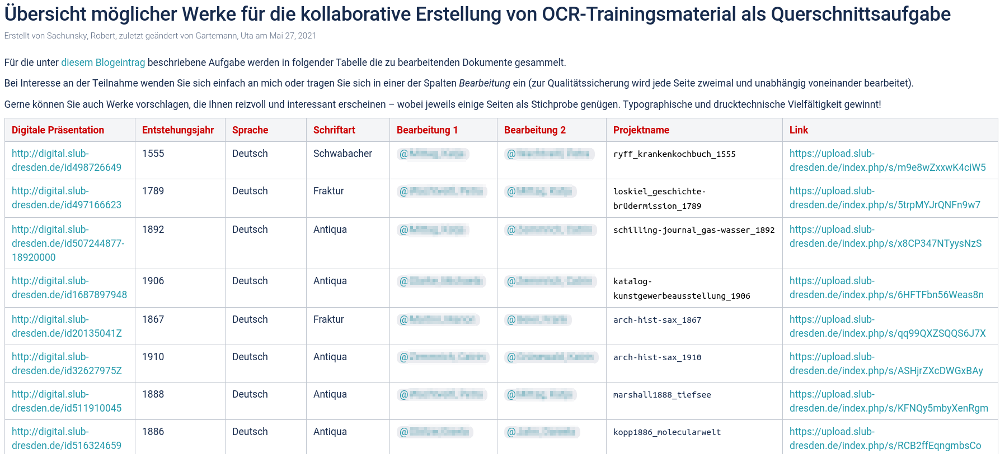

---

# Datenvorbereitung – OCR-Workflow

- Konfiguration und Prozessierung mit [OCR-D](https://ocr-d.de)
- meist:
  * Binarisierung: [SBB](https://github.com/qurator-spk/sbb_binarization) (neuronal)
  * Cropping: [Ocropus](https://github.com/OCR-D/ocrd_anybaseocr) (regelbas.)
  * Deskewing: [Ocropus](https://github.com/cisocrgroup/ocrd_cis/) / [Tesseract](https://github.com/OCR-D/ocrd_tesserocr) (regelbas.)
  * Segmentierung: [Ocropus](https://github.com/cisocrgroup/ocrd_cis/) / [Tesseract](https://github.com/OCR-D/ocrd_tesserocr) (regelbas.)
  * Dewarping: [Ocropus](https://github.com/cisocrgroup/ocrd_cis/) (regelbas.)
  * Erkennung: [Tesseract](https://github.com/OCR-D/ocrd_tesserocr) (neuronal)
- Anpassung je nach Material und Sprachen
- Rückgriff auf existierende, bestpassende OCR-Modelle

---

# Datenvorbereitung – Ergebnisse

* typische Defizite sichtbar:

<table>
  <thead><tr><th><strong>Antiqua</strong></th><th><strong>Fraktur</strong></th></tr></thead>
  <tbody style="font-size:0.7em">
    <tr>
      <td>
<code class="remark-inline-code">[fl{]</code> → <code class="remark-inline-code">ſ</code>   Ligaturen   <code class="remark-inline-code">.</code> ←→ <code class="remark-inline-code">,</code>   <code class="remark-inline-code">[A-Z]</code> → <code class="remark-inline-code">[a-z]</code>
</td>
      <td>
<code class="remark-inline-code">[fl]</code> → <code class="remark-inline-code">ſ</code>   <code class="remark-inline-code">äöü</code> → <code class="remark-inline-code">aͤoͤuͤ</code>   <code class="remark-inline-code">[-=:–]</code> → <code class="remark-inline-code">⸗</code>   <code class="remark-inline-code">BSC1</code> → <code class="remark-inline-code">VFTI</code>
</td>
    </tr>
    <tr>
      <td>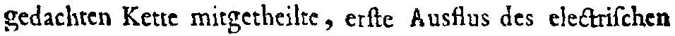</td>
      <td>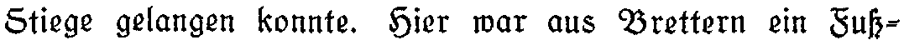</td>
    </tr>
    <tr>
      <td>gedachten Kette mitgetheilte<u> </u>, er<u>f</u>te Ausflus des ele<u>&</u>tri<u>f</u>chen</td>
      <td>Stiege gelangen konnte. Hier war aus Brettern ein <u>S</u>u<u>f-</u></td>
    </tr>
    <tr>
      <td>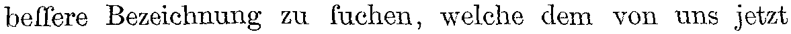</td>
      <td></td>
    </tr>
    <tr>
      <td>be<u>ff</u>ere Bezeichnung <u>ZU</u> <u>f</u>uchen, welche dem von uns <u>J</u>etzt</td>
      <td>Br<u>ü</u>der<u> - </u>Unit<u>ä</u>t iſt die unter die Indianer in</td>
    </tr>
    <tr>
      <td>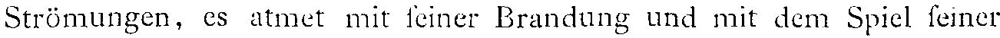</td>
      <td>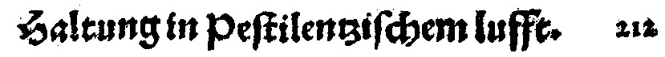</td>
    </tr>
    <tr>
      <td style="font-size:0.9em">Strömungen, <u>CS</u> atmet mit <u>f</u>einer <u>3</u>randung und mit dem Spiel <u>f</u>einer</td>
      <td><u>S</u>altun<u>gi</u>n <u>p</u>eſtilentziſchem luff<u>e</u>. 212</td>
    </tr>
    <tr>
      <td>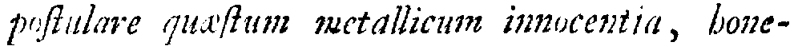</td>
      <td>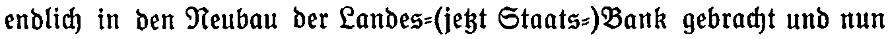</td>
    </tr>
    <tr>
      <td>p<u>ufl</u>ula<u>v</u>e qu<u>afl</u>um<u>.</u> metallicum innocentia, bone-</td>
      <td style="font-size:0.9em">endlich in den Neubau der Landes<u>-</u>(je<u>ß</u>t Staats<u>-</u>)Bank gebracht und nun</td>
    </tr>
  </tbody>
</table> 

 <!-- **Sorbisch** | -->
 <!-- --- | -->
 <!-- `é` → `[ćč]`   `s` → `š`   `[öèéeoͤ]` → `ě`   `[Zz]` → `ž`   `[ftr]` → `ř`   `t` → `ł` | -->
 
 
---

class: part-slide

# Transkription

- Annotationsumgebung
- Richtlinien
- Textnormalisierung
- Ergebnisse

---

# Transkription – Annotationsumgebung

- Excel / LibreOffice Calc
    * verbreitete Software (keine Installation oder Schulung nötig)
    * **offline** verwendbar, keine zentrale Datenhaltung
    * Rechtschreibkontrolle als Unterstützung
    * Symboltabelle für Sonderzeichen

---

count: false

# Transkription – Annotationsumgebung

- Excel / LibreOffice Calc
    * verbreitete Software (keine Installation oder Schulung nötig)
    * **offline** verwendbar, keine zentrale Datenhaltung
    * Rechtschreibkontrolle als Unterstützung
    * Symboltabelle für Sonderzeichen
- 1 Tabelle pro Seite mit 1 Zeile pro Textzeile und Spalten für:
    * ID (aus XML)
    * Text (aus OCR)
    * Status (offen/fertig/fehlerhaft)
    * Bild (aus Binarisierung und Zeilensegmentierung)
    * Helferlein
        + Klick → Faksimile (DFG-Viewer)
        + Zeichentabelle als Kopiervorlage

---

# Transkription – Annotationsumgebung

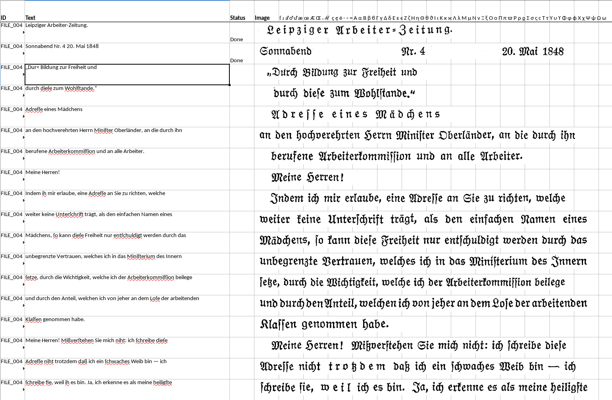

---

# Transkription – Richtlinien

- Orientierung an [DTA](https://www.deutschestextarchiv.de/doku/basisformat/transkription.html) / [OCR-D](https://ocr-d.de/de/gt-guidelines/trans/transkription.html) **GT-Level 2**  
  * bester Kompromiss aus Aufwand und Genauigkeit
  * häufige Eingabe von Sonderzeichen (`ſ ꝛ aͤ oͤ uͤ  — ⸗` …)
  * in der Praxis auftretende Grenzfälle bzw. Lücken

---

count: false

# Transkription – Richtlinien

- Orientierung an [DTA](https://www.deutschestextarchiv.de/doku/basisformat/transkription.html) / [OCR-D](https://ocr-d.de/de/gt-guidelines/trans/transkription.html) **GT-Level 2**  
  * bester Kompromiss aus Aufwand und Genauigkeit
  * häufige Eingabe von Sonderzeichen (`ſ ꝛ aͤ oͤ uͤ  — ⸗` …)
  * in der Praxis auftretende Grenzfälle bzw. Lücken

---

count: false

# Transkription – Richtlinien

- Orientierung an [DTA](https://www.deutschestextarchiv.de/doku/basisformat/transkription.html) / [OCR-D](https://ocr-d.de/de/gt-guidelines/trans/transkription.html) **GT-Level 2**  
  * bester Kompromiss aus Aufwand und Genauigkeit
  * häufige Eingabe von Sonderzeichen (`ſ ꝛ aͤ oͤ uͤ  — ⸗` …)
  * in der Praxis auftretende Grenzfälle bzw. Lücken

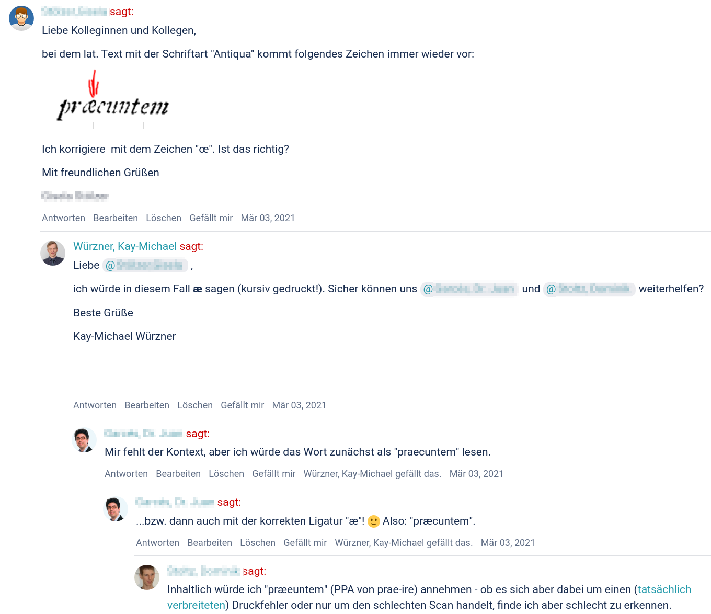

---

count: false

# Transkription – Richtlinien

- Orientierung an [DTA](https://www.deutschestextarchiv.de/doku/basisformat/transkription.html) / [OCR-D](https://ocr-d.de/de/gt-guidelines/trans/transkription.html) **GT-Level 2**  
  * bester Kompromiss aus Aufwand und Genauigkeit
  * häufige Eingabe von Sonderzeichen (`ſ ꝛ aͤ oͤ uͤ  — ⸗` …)
  * in der Praxis auftretende Grenzfälle bzw. Lücken

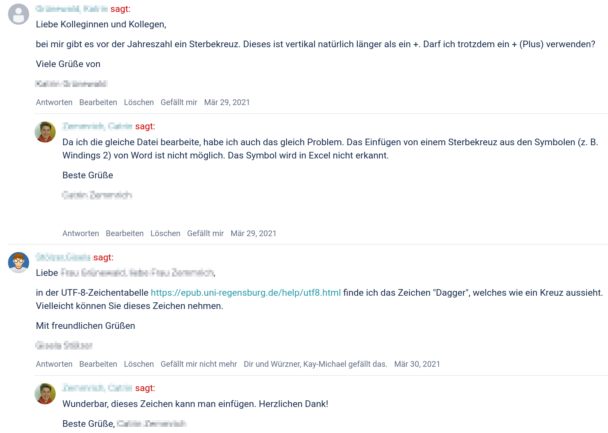

---

# Transkription – Textnormalisierung

- automatische Ersetzung bestimmter Muster zur Bereinigung von
  * typischen Flüchtigkeitsfehlern
  * systematischen Abweichungen (wie Konventionen zu Interpunktion)
- Erhöhung der Ausbeute, Vermeidung von Unterrepräsentation
  * Gerade schwierige Daten sind wertvoll für das Training!
- abhängig vom Material (manchmal/immer ohne/mit `aͤ` `oͤ` `uͤ` `ſ` `ß` `⸗` `,` …) <!-- oder gemischt -->
- Beispiele:  

| `r" ⸗ "` → `"⸗"`   `r"ä"` → `"aͤ"`   `r"[=-]$"` → `"⸗"` | `r" /"` → `"/"`   `r"/(?=\S)"` → `"/ "` |
| --- | --- |
|  |  |
| Bruͤder<u> = </u>Unit<u>ä</u>t iſt die unter die Indianer in | bel<u> </u>/ Knoblauch<u> </u>/ Senff<u> </u>/ Eſſig<u> </u>/ Saltz vñ |

---

# Transkription – Ergebnisse

.cols[
.fifty[
     
- Umfang (vorläufig):
  * 18 Bearbeitende, ~200 Emails
  * 16 Werke, 10 mit Double-Keying  
    → &nbsp;6473 Seiten (vollständig)  
    → &nbsp;&nbsp;477 Seiten (vorausgewählt)  
    → 20808 Zeilen (vorausgewählt)  
    → 14909 Zeilen (korrigiert)  
    → 13335 Zeilen (übereinstnd.)
    
]

.fifty[
  
- Inter-Annotator-Agreement
    * 85% Zeilen (DK-Ausbeute)
    * **99.5%** Zeichen (= 0.5% CER)
- Genauigkeit Baseline-OCR
    * **97.2%** Zeichen (= 2.8% CER)
    * nur Fraktur
        * `GT4HistOCR+frk+Fraktur`
        * **98.8%** Zeichen (= 1.2% CER)  
    * nur Antiqua
        * `deu+Latin`
        * **96.2%** Zeichen (= 3.8% CER)  

]
]

---

class: part-slide

# Training

- Vorgehen
- Ergebnisse

---

# Training – Vorgehen

- Modelle für Tesseract  
  – mit [tesstrain](https://github.com/tesseract-ocr/tesstrain)
- randomisierte 10%-Aufteilung (Test- und Trainingsdaten)  
  – je Werk
- Gruppierung der Dateipaare (werkspezifisch vs. generisch)  
  – per Symlinks
- Trainingsregime  
  – Modellanpassung (*Finetuning*) vs. grundständiges Training,
  Parameterwahl (Basismodell, Lernrate, Iterationen)
- Augmentierung (für robustere Modelle)  
  – Rauschen, Binarisierung, Drehung, Verzerrung

---

# Training – Experimente

- werkspezifisches Finetuning
- generisches Finetuning (nur Fraktur)
- generisches Finetuning (nur Antiqua)
- generisches Finetuning (alles)
- grundständiges Training (mit weiteren Daten)

---

# Training – Ergebnisse

.smaller[

| **Werk** | **Schriftart** | **CER vorher** | **CER nachher** |
| --- | --- | --- | --- |
| `ryff1555_krankenkochbuch` | Schwabacher | 3.8% | 2.1% |
| `koenig1763_cosmogonia` | Antiqua | 5.1% | 1.7% |
| `wallerius1768_elementa-metallurgiae` | Antiqua | 7.4% | 3.5% |
| `loskiel1789_geschichtebrüdermission` | Fraktur | 1.7% | 1.2% |
| `cotta1811_rede-forstlehranstalt` | Antiqua | 1.2% | 1.3% |
| `arch-hist-sax_1867` | Fraktur | 0.6% | 0.1% |
| `hansen1874_lichtbrechung` | Antiqua | 9.5% | 2.9% |
| `gabelentz1879_melanesisch` | Antiqua | 3.4% | 2.2% |
| `bogusławski1884_nationalgeschichte` | Antiqua | 7.5% | 2.0% |
| `kopp1886_molecularwelt` | Antiqua | 5.0% | 2.0% |
| `marshall1888_tiefsee` | Antiqua | 8.5% | 2.9% |
| … | … | … | … |

]

---

count: false

# Training – Ergebnisse

.smaller[

| **Werk** | **Schriftart** | **CER vorher** | **CER nachher** |
| --- | --- | --- | --- |
| … | … | … | … |
| `schilling1892_journal-gas-wasser` | Antiqua | 0.9% | 1.4% |
| `arch-hist-sax_1910` | Antiqua | 1.8% | 0.4% |
| `katalogkunstgewerbeausstellung_1906` | Antiqua | 1.5% | 3.5% |
| `hottenroth1925_jugenderinnerungen` | Fraktur | 0.6% | 0.1% |
| `schmidt1936_thueringische-studien` | Fraktur | 0.6% | 0.6% |
|  |  |  |  |
| generisch | Antiqua | 3.8% | 2.1% |
| generisch | Fraktur | 1.2% | 0.7% |
| generisch | alles | 2.8% | 1.6% |

]

---

class: part-slide

# Zusammenfassung

---

# Zusammenfassung – Arbeitsablauf

0. Werkauswahl (manuell)
1. OCR-Workflow (manuell optimiert je Werk)
2. Extraktion von .xslx-Dateien
   - 1 Datei pro Seite
   - 1 Zeile pro Textzeile
4. Transkription (manuelle Textkorrektur)
   - Verteilung an je 2 Bearbeiter
5. Import des Rücklaufs
   - Textnormalisierung (automatische Nachkorrektur; optional)
   - Double-Keying (automatische Qualitätskontrolle)
   - Konfliktbereinigung (manuelle Nachkorrektur; optional)
6. Export als Trainingsdaten
   - Publikation auf [Github](https://github.com/slub/slub_ocr_gt)
7. Training und Experimente

---

# Zusammenfassung – Ergebnisse

- Verwendung des **flexiblen OCR-D-Ökosystems**
- niedrigschwellige Transkriptionsumgebung
- vielversprechende Ergebnisse 
    * sowohl bei **Transkription** als auch **Training**
- gutes **Datenmanagement** mit Versionierung nötig
- eindeutige **Transkriptionsrichtlinien** erforderlich
- freie und offene Veröffentlichung der **Daten und Methoden**

---

# Zusammenfassung – Perspektiven

- **systematische Experimente** zum OCR-Training
    + Spannungsfeld **generische** vs. **spezifische** Modelle
    + Robustheit durch variable **Bildvorverarbeitung** und **Augmentierung**
- **Gemeinschaftsaufgabe**: Lückenschluss im Bereich OCR-Trainingsdaten
    + ggf. unter Einbindung **bürgerwissenschaftlicher Kontexte** in die Datenproduktion
- Übertrag der Erkenntnisse auf die Erkennung **handschriftlicher Materialien**

---

# Vielen Dank für Ihre Aufmerksamkeit!

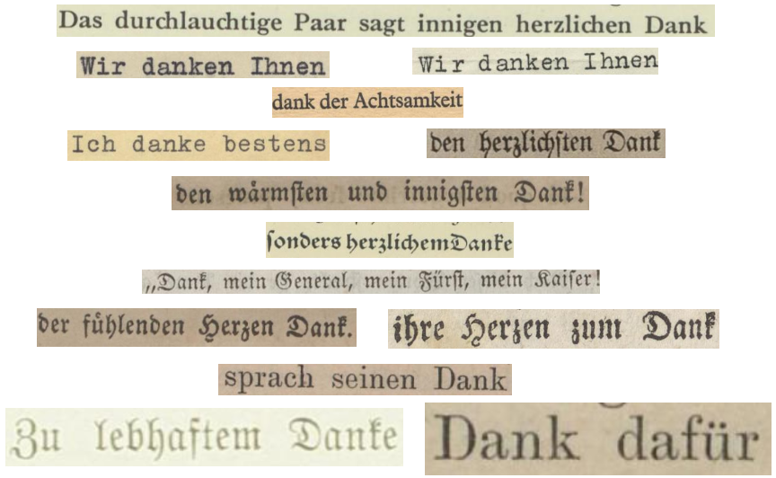

.center[
[wrznr.github.io/bibliothekartag-2021](https://wrznr.github.io/bibliothekartag-2021)
[github.com/slub/slub_ocr_gt](https://github.com/slub/slub_ocr_gt)
]
